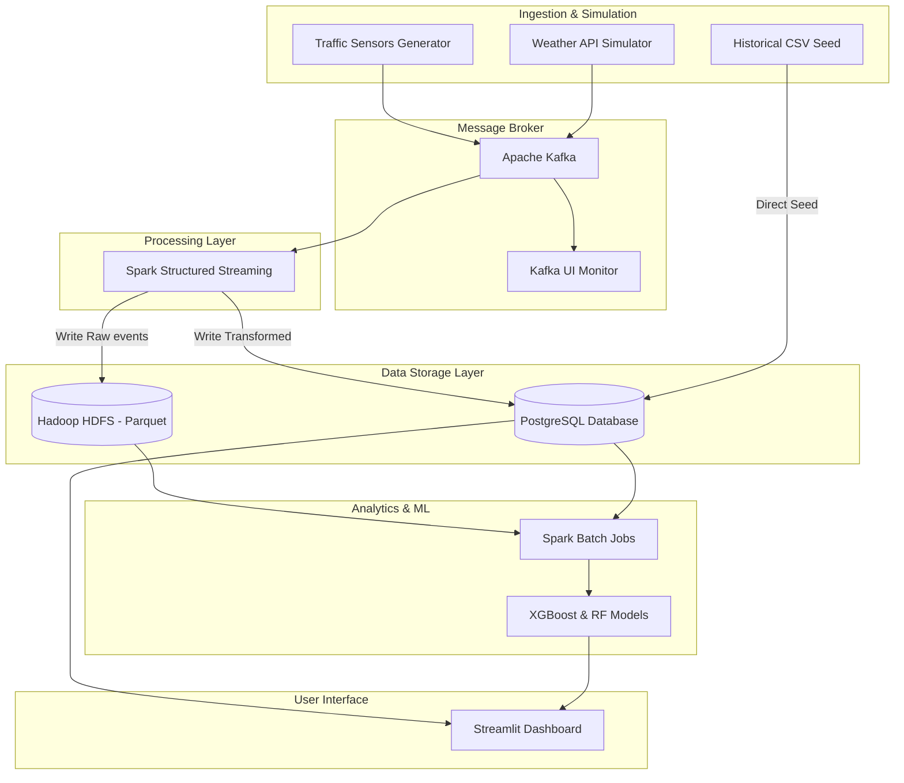
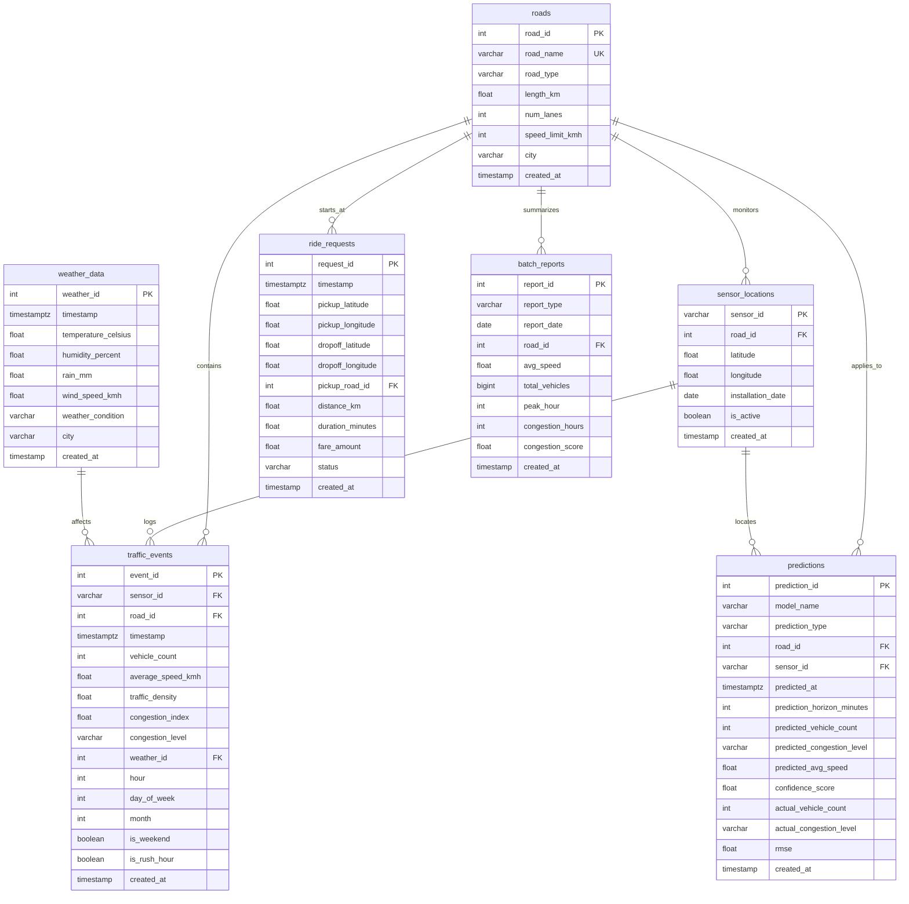

# SmartFlow — Smart City Traffic Management & Ride Demand Prediction Platform

[](https://www.python.org/)
[](https://kafka.apache.org/)
[](https://spark.apache.org/)
[](https://www.docker.com/)
[](https://opensource.org/licenses/MIT)

SmartFlow is an end-to-end Big Data & Machine Learning platform for real-time Cairo city traffic telemetry ingestions, schema enrichment, historical storage in HDFS, aggregated batch reports, ML predictions, and visualization.

---

## 🏗️ System Architecture



---

## 🗺️ Entity Relationship (ER) Diagram



---

## 🚀 Installation & Local Operations

### Prerequisites
*   Python 3.11 (Standard Windows distribution recommended)
*   Docker & Docker Compose (Optional; if absent, the app falls back to local SQLite)
*   Java JDK 11 (For running Spark streaming jobs locally)

---

### Step 1: Locate standard Python on Windows
If standard Python is installed, locate its absolute path using one of the following commands:
```powershell
# Option A: Query the system search path for python
where.exe python

# Option B: Search for installed python versions in your user AppData directory
Resolve-Path "C:\Users\*\AppData\Local\Programs\Python\Python*\python.exe"
```
*Take note of the printed path (e.g. `C:\Users\PC\AppData\Local\Programs\Python\Python311\python.exe`).*

---

### Step 2: Create a Virtual Environment (`venv`)
Use the located python executable path (or just `python` if standard python is in your PATH) to create the environment:
```powershell
# Create a venv named 'venv'
C:\Users\<Your_User>\AppData\Local\Programs\Python\Python311\python.exe -m venv venv
```

---

### Step 3: Activate the Virtual Environment (Optional)
If you want to activate the virtual environment in your current terminal session:
```powershell
# PowerShell
.\venv\Scripts\Activate.ps1

# CMD
.\venv\Scripts\activate.bat
```

---

### Step 4: Install Dependencies
Run pip using the virtual environment's pip executable directly:
```powershell
# Install required packages
.\venv\Scripts\pip.exe install -r requirements.txt
.\venv\Scripts\pip.exe install psycopg2-binary

# Copy environment template
cp .env.example .env
```

---

### Step 5: Spin up database and Kafka (Optional)
If Docker Desktop is installed and you want to use the live Kafka/Postgres streaming pipeline:
```bash
docker-compose up -d postgres zookeeper kafka kafka-ui
```
*Note: If you do not have Docker running, you can skip this step. The database client automatically falls back to a local SQLite database (`data/sample/local_smartflow.db`) populated directly from the generated CSV files.*

---

### Step 6: Generate Data, Ingest Schema, & Train Models (Direct venv Commands)
Run these commands using the virtual environment's python directly:
```powershell
# 1. Generate 30 days of mock historical CSVs
.\venv\Scripts\python simulator/historical_generator.py

# 2. Bootstrap database schema and seed/ingest data (Creates SQLite DB locally or loads PostgreSQL)
.\venv\Scripts\python ingestion/ingestion.py

# 3. Train initial ML Models on the generated dataset
.\venv\Scripts\python ml/train.py
```

---

### Step 7: Start the Streamlit Dashboard UI
Launch the dashboard using the virtual environment's streamlit executable directly:
```powershell
.\venv\Scripts\streamlit run dashboard/Home.py
```
Open **`http://localhost:8501`** in your browser. If database containers were skipped, the app will run seamlessly in offline SQLite fallback mode!

---

## 🛠️ Makefile targets
Simplify developer commands:
*   `make setup`: Installs packages.
*   `make generate-data`: Generates mock historical CSVs.
*   `make start-simulator`: Starts real-time traffic generators.
*   `make train-models`: Trains scikit-learn & XGBoost estimators.
*   `make test`: Runs test suite.
