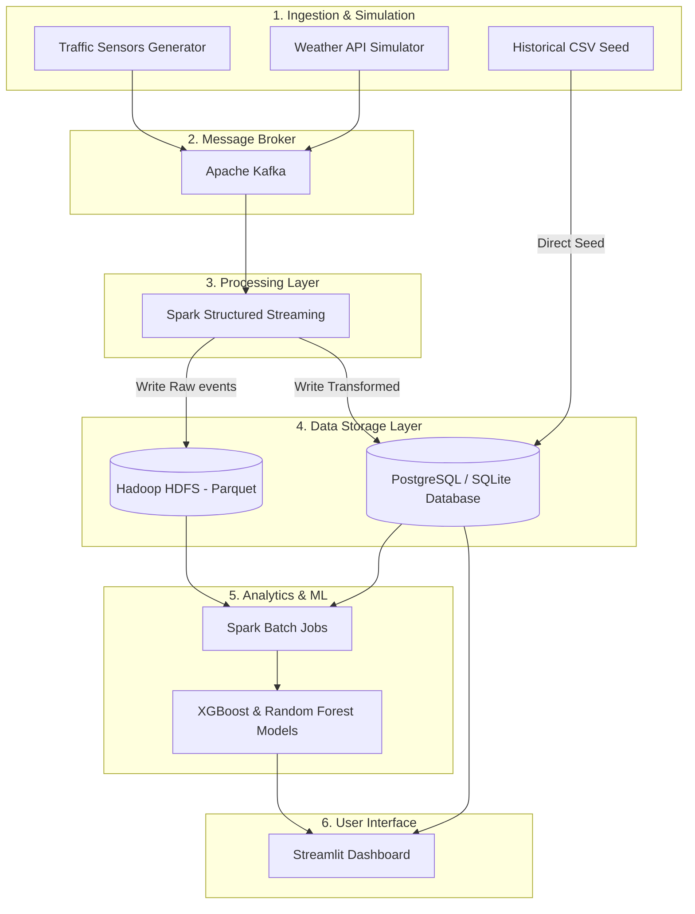

# 🏗️ SmartFlow — System Architecture & Technology Stack

This document details how the SmartFlow Cairo Traffic Management Platform operates end-to-end, mapping features to their respective technologies and code modules.

---

## 🗺️ Architectural Diagram

The platform operates across 6 key layers, moving from streaming ingestion to storage, analytics, and visual interfaces:



---

## 💻 Tech Stack & Module Mapping

Here is the exact technology used in each module of the platform:

### 1. Ingestion & Simulation Layer
Generates mock telemetry data representing real-time traffic and weather conditions in Cairo.
*   **Technologies**: Python 3.11, `Faker` (for fake sensor locations/metadata), `pandas`
*   **Key Files**:
    *   [historical_generator.py](file:///e:/Project/SmartFlow/simulator/historical_generator.py): Generates 30 days of mock CSV telemetry for training and bootstrap testing.
    *   [traffic_generator.py](file:///e:/Project/SmartFlow/simulator/traffic_generator.py): Simulates streaming sensor outputs and publishes them to Kafka.
    *   [weather_generator.py](file:///e:/Project/SmartFlow/simulator/weather_generator.py): Simulates dynamic weather conditions and publishes to Kafka.

### 2. Message Broker Layer
Serves as the high-throughput, low-latency streaming pipeline broker.
*   **Technologies**: Apache Kafka, `kafka-python-ng`
*   **Key Files**:
    *   [producer.py](file:///e:/Project/SmartFlow/kafka/producer.py): Fault-tolerant producer wrapper with Dead Letter Queue (DLQ) retry routing.
    *   [consumer.py](file:///e:/Project/SmartFlow/kafka/consumer.py): Generic thread-safe message consumer interface.
    *   [topics.py](file:///e:/Project/SmartFlow/kafka/topics.py): Automated topic manager for verifying and creating streaming channels.

### 3. Processing Layer (Real-time & Batch)
Processes telemetry streams, calculates traffic metrics, and runs analytical aggregations.
*   **Technologies**: Apache Spark 3.5 (Spark Structured Streaming & Spark SQL)
*   **Key Files**:
    *   [streaming.py](file:///e:/Project/SmartFlow/spark/streaming.py): Spark Structured Streaming job that consumes from Kafka, cleans data, computes congestion indices, and writes raw records to HDFS and enriched aggregates to PostgreSQL.
    *   [batch_processing.py](file:///e:/Project/SmartFlow/spark/batch_processing.py): Spark Batch engine that runs daily reports, finding peak hours and bottlenecked roadways.

### 4. Data Storage Layer (Warehouse)
Retains both raw stream files (for data-lake analytics) and transactional relational states (for dashboard retrieval).
*   **Technologies**: Hadoop HDFS (Parquet serialization format), PostgreSQL, SQLAlchemy.
*   **Key Files**:
    *   [postgres.py](file:///e:/Project/SmartFlow/storage/postgres.py): Relational database client. Includes an automatic **local SQLite fallback** populated from historical CSVs if the PostgreSQL instance is offline.
    *   [hdfs.py](file:///e:/Project/SmartFlow/storage/hdfs.py): Parquet storage writer for logging telemetry files.

### 5. Machine Learning Layer
Learns traffic profiles and predicts future vehicle demands.
*   **Technologies**: `scikit-learn` (StandardScaler, RandomForestRegressor, GradientBoostingRegressor), `XGBoost`
*   **Key Files**:
    *   [train.py](file:///e:/Project/SmartFlow/ml/train.py): Compares Linear Regression, Random Forest, Gradient Boosting, and XGBoost regressor models, saving the best performing model.
    *   [predict.py](file:///e:/Project/SmartFlow/ml/predict.py): Loads the trained model to perform real-time inferences, falling back to heuristics if model files are missing.
    *   [evaluate.py](file:///e:/Project/SmartFlow/ml/evaluate.py): Compiles evaluation metrics ($R^2$, MAE, RMSE).

### 6. User Interface Layer
Exposes live telemetry, historical charts, map visualizers, and predictive input models.
*   **Technologies**: Streamlit, Plotly Express (charts), Folium (interactive maps)
*   **Key Files**:
    *   [Home.py](file:///e:/Project/SmartFlow/dashboard/Home.py): Live KPIs, total vehicle volume, and real-time raw feed monitoring.
    *   [Live.py](file:///e:/Project/SmartFlow/dashboard/pages/Live.py): Geographic map visualizer showing Cairo traffic sensors.
    *   [Analytics.py](file:///e:/Project/SmartFlow/dashboard/pages/Analytics.py): Time-series trend lines, peak hours bar charts, and congestion heatmaps.
    *   [Prediction.py](file:///e:/Project/SmartFlow/dashboard/pages/Prediction.py): Real-time AI prediction tool using the serialized Random Forest/XGBoost models.

---

## 🔄 End-to-End Data Lifecycle

```
[Simulators] ──(Produce JSON)──> [Kafka Topics]
                                       │
                                (Consume Stream)
                                       ▼
                       [Spark Structured Streaming Job]
                          /                        \
           (Save Raw Parquet)            (Save Enriched SQL)
                        /                            \
                       ▼                              ▼
                 [HDFS Storage]             [PostgreSQL / SQLite]
                       │                              │
                (Batch Analytics)             (Load Historicals)
                       ▼                              ▼
             [Spark Batch Engine] ──────────> [Streamlit UI]
                       │                              ▲
                (Train Models)                (Real-time Inferences)
                       ▼                              │
              [Trained ML Model] ─────────────────────┘
```
