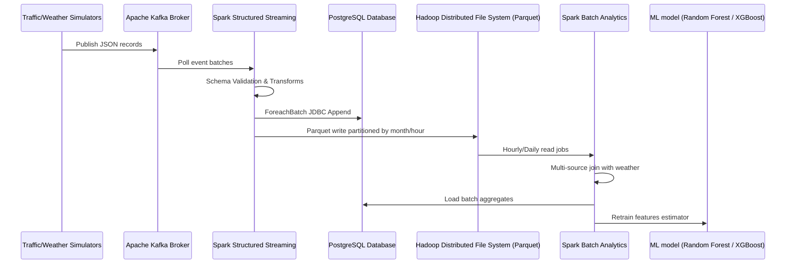

# SmartCity Traffic Platform Architecture Deep Dive

Here is the flow chart representation of our real-time pipelines.

## Data flow

This sequence represents the flow from edge sensors simulated in Cairo all the way to analytical dashboards.
